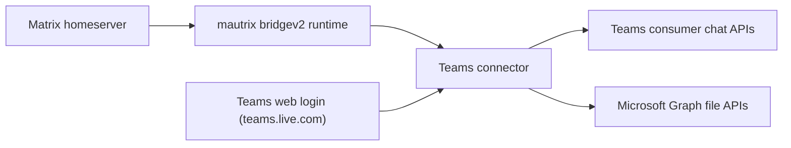

# mautrix-teams

`mautrix-teams` is a Matrix ↔ Microsoft Teams bridge built on the mautrix `bridgev2` framework. It currently targets the consumer Teams web client stack at `teams.live.com`, translating Matrix events into Teams web API calls and polling Teams conversations back into Matrix.

This bridge exists because Microsoft does not provide a stable, public Matrix bridge surface for Teams. The implementation relies on reverse-engineered Teams web and token flows, which makes it usable for experimentation and small-maintainer deployments, but inherently fragile when Microsoft changes the web client, token scopes, or message APIs.

## Status

- Current state: experimental, but runnable for maintainers who are comfortable debugging bridgev2, Matrix appservices, and Teams web auth.
- Auth model: delegated user auth captured from the Teams web app; there is no client-credentials or tenant-admin auth path in this repo today.
- Network scope: the current code is built around `teams.live.com` consumer endpoints and tokens, not the enterprise `teams.microsoft.com` stack.
- Transport model: Teams ingress is polling-based, not websocket/subscription-based.

## Feature Matrix

| Area | Status | Notes |
| --- | --- | --- |
| Teams login via embedded webview/localStorage extraction | Supported | Requires a bridgev2-compatible login UX. The bridge extracts MSAL localStorage, then derives refresh, Skype, and Graph tokens. |
| Text messages Matrix → Teams | Supported | Sent as rich-text HTML payloads through Teams consumer chat APIs. |
| Text messages Teams → Matrix | Supported | Polled from Teams conversations and converted into Matrix message events. |
| DM and group chat discovery | Supported | Thread discovery runs on a timer and creates/resyncs portals as chats appear. |
| Reactions Matrix → Teams | Partial | Only the mapped Teams emoji/emotion set is supported. Unsupported emoji are rejected. |
| Reactions Teams → Matrix | Partial | Reaction sync is implemented for known Teams emotion keys. Unknown keys are ignored. |
| Attachments Matrix → Teams | Supported | Uses Microsoft Graph upload + Teams attachment message send; current in-memory size cap is 100 MiB. |
| Attachments Teams → Matrix | Partial | Best when Graph token + DriveItem metadata are present; otherwise the bridge falls back to textual attachment links in the caption. |
| GIFs | Partial | Common Teams GIF payloads are recognized; conversion is best-effort. |
| Typing Matrix → Teams | Supported | Outbound typing indicators are sent to Teams. |
| Typing Teams → Matrix | Unsupported | No inbound typing ingestion path exists today. |
| Read receipts Matrix → Teams | Supported | Sent as Teams consumption horizon updates after unread activity is observed. |
| Read receipts Teams → Matrix | Partial | Inbound receipt polling exists, but is conservative and effectively geared toward 1:1-style horizons. |
| Message edits | Unsupported | No edit mapping layer exists in the current connector. |
| Message deletes / redactions | Unsupported | No delete/unsend bridge flow exists in the current connector. |
| Replies / threads as first-class semantics | Unsupported | Messages bridge as flat chat traffic. |
| Profile display names | Partial | Display names are cached from observed traffic; profile sync is not comprehensive. |

## Architecture

High level:

- The mautrix `bridgev2` runtime owns Matrix appservice behavior, portal state, encryption support, and common bridge config.
- `pkg/connector` implements the Teams-specific login flow, send handlers, polling loop, and message conversion hooks.
- `internal/teams/auth` extracts Teams web auth state, refreshes delegated tokens, and acquires the Teams `skypetoken` used by chat APIs.
- `internal/teams/client` talks to reverse-engineered Teams consumer endpoints for conversations, messages, reactions, typing, and read markers.
- `internal/teams/graph` handles Graph-backed attachment upload/download for files.

More detail: [docs/setup.md](docs/setup.md), [docs/configuration.md](docs/configuration.md), [docs/architecture.md](docs/architecture.md), [docs/operations.md](docs/operations.md)

## Project Layout

- [cmd/mautrix-teams/main.go](cmd/mautrix-teams/main.go): bridge entrypoint and mautrix `BridgeMain` wiring.
- [pkg/connector](pkg/connector): Teams connector, login flow, polling, Matrix handlers, message conversion.
- [internal/teams/auth](internal/teams/auth): MSAL/localStorage extraction, refresh-token exchange, Skype token acquisition.
- [internal/teams/client](internal/teams/client): HTTP clients for Teams conversations, messages, reactions, typing, and read markers.
- [internal/teams/graph](internal/teams/graph): delegated Graph file upload/download helpers.
- [internal/bridge](internal/bridge): attachment orchestration and Matrix media helpers.
- [pkg/teamsdb](pkg/teamsdb): Teams-specific state tables for thread cursors, profile cache, and consumption horizons.

## Known Limitations

- The bridge depends on undocumented Teams web behavior and may break without warning.
- The current implementation targets consumer/live Teams endpoints, not general Microsoft 365 enterprise deployments.
- Fresh login depends on a bridgev2-compatible webview/cookie extraction flow. Beeper supports this directly; other environments may need custom provisioning UX.
- Teams ingress is polling-based, so message delivery is near-real-time rather than true push.
- Attachment bridging is only fully successful when delegated Graph tokens remain refreshable and inbound messages expose Graph/Drive metadata.
- Unsupported event classes such as edits, deletes, and inbound typing are not silently handled; they are simply not bridged today.
