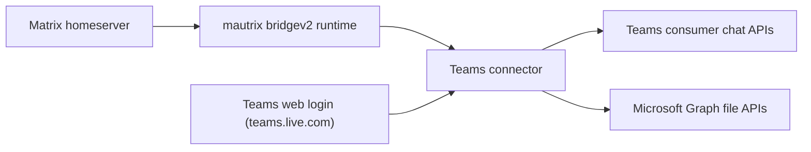

# mautrix-teams

`mautrix-teams` is an experimental Matrix ↔ Microsoft Teams bridge built on the mautrix `bridgev2` framework.

It currently targets the consumer Teams web stack at `teams.live.com`, using delegated user auth and polling-based sync. The project is aimed at self-hosters who want to connect personal Microsoft Teams chats to Beeper or another Matrix client and are comfortable running a Matrix appservice bridge.

## Who This Is For

This bridge is a fit if you:

- want to bridge personal or consumer Microsoft Teams chats into Matrix
- already operate, or can configure, a Matrix homeserver appservice
- are comfortable building a Go binary and editing bridge config
- can tolerate some maintenance overhead from reverse-engineered upstream APIs

This bridge is probably not a fit if you need:

- enterprise or tenant-managed Microsoft Teams support
- an officially supported Microsoft integration path
- a zero-maintenance bridge that is unlikely to break when Teams changes upstream behavior

## Scope And Limitations

Current project constraints:

- consumer Teams only, via `https://teams.live.com/v2`
- delegated user auth only
- polling-based Teams sync rather than push subscriptions
- attachment support depends on delegated Microsoft Graph access
- some Matrix and Teams semantics are still incomplete

Operationally, that means the bridge is best treated as a maintainer-run project for technically comfortable users rather than a polished appliance.

## Getting Started

This is the shortest path to a first local run.

### Prerequisites

- Go 1.24+
- a Matrix homeserver where you can register an appservice
- a Microsoft Teams consumer account that can sign in at `https://teams.live.com/v2`
- a Matrix client or provisioning UI that can drive mautrix `bridgev2` login flows
- SQLite for quick local testing, or Postgres for a longer-lived deployment

Important setup notes:

- the bridge generates an appservice registration file, but does not install it into your homeserver for you
- outside Beeper, you need some `bridgev2`-compatible provisioning UI or custom integration for the Teams webview login flow
- `config.example.yaml` is the recommended starting point for most setups

### Build

```sh
./build.sh
```

Or:

```sh
go build -o mautrix-teams ./cmd/mautrix-teams
```

### Create A Config

Start with the example config:

```sh
cp config.example.yaml config.yaml
```

Recommended local defaults:

- `database.type: sqlite3-fk-wal`
- `database.uri: file:mautrix-teams.db?_txlock=immediate`
- `homeserver.software: standard` unless you intentionally use Hungryserv/WebSocket mode
- `homeserver.websocket: false` for ordinary Synapse or Dendrite-style appservice operation

At minimum, fill in:

- `homeserver`
- `appservice`
- `database`
- `bridge.permissions`
- `provisioning.shared_secret` if you use provisioning endpoints

If you need the full autogenerated mautrix config instead of the trimmed example:

```sh
./mautrix-teams -e
```

### Generate The Appservice Registration

```sh
./mautrix-teams -g -c config.yaml -r registration.yaml
```

Install `registration.yaml` using your homeserver's normal appservice registration process, then restart or reload the homeserver as required.

### Run The Bridge

```sh
./mautrix-teams -c config.yaml
```

Expected first-run behavior:

- the bridge connects to Matrix
- Teams-specific database tables are created or upgraded
- the appservice bot becomes available on Matrix
- no Teams traffic flows until a user completes login

### Complete A Teams Login

The connector exposes a cookie/webview-based login flow named `teams.live.com (in-app browser)`.

During login, the user signs into Teams in an embedded browser, the bridge extracts Teams web storage, derives the delegated token state it needs, and starts background sync for that account.

### Verify The Basics

Use this quick checklist:

1. The bridge process stays up and logs a successful Matrix connection.
2. The user login reaches a connected state instead of `bad_credentials`.
3. A Teams chat appears as a Matrix portal room after thread discovery.
4. Sending a Matrix text message produces a new Teams message.
5. A Teams reply is polled back into Matrix within the polling window.

## Supported Features

Supported today:

- Teams login
- text messages in both directions
- DM and group chat discovery
- reactions
- attachments in both directions
- GIF handling
- Matrix → Teams typing
- read receipts in both directions
- profile display names

Not yet supported:

- Teams → Matrix typing
- message edits
- message deletes or redactions
- reply or thread semantics

## High-Level Architecture

At a high level, the bridge sits between a Matrix homeserver and the reverse-engineered Teams consumer APIs, with Microsoft Graph used for attachment handling.



Main components:

- `pkg/connector` for login orchestration, polling, Matrix event handling, and message conversion
- `internal/teams/auth` for Teams web token extraction and refresh
- `internal/teams/client` for Teams chat API access
- `internal/teams/graph` for file upload and download paths
- `pkg/teamsdb` for Teams-specific cursor and profile state

For the full flow and design tradeoffs, see [docs/architecture.md](docs/architecture.md).

## Additional Docs

- [docs/configuration.md](docs/configuration.md) for the full config model and field-level guidance
- [docs/operations.md](docs/operations.md) for runtime behavior, common failures, and recovery guidance
- [docs/architecture.md](docs/architecture.md) for the deeper architecture writeup
