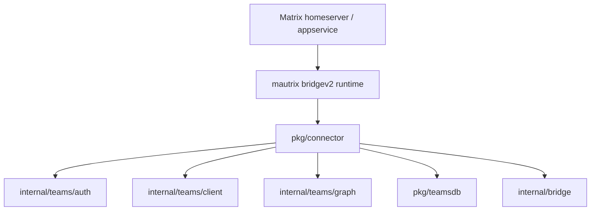
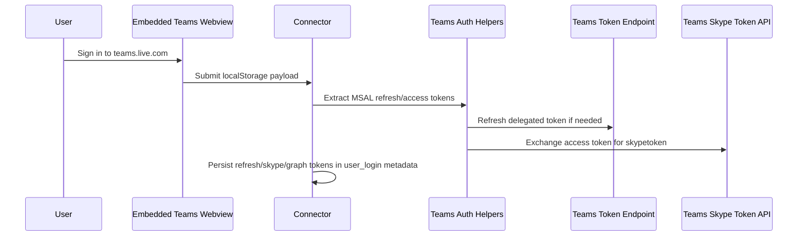
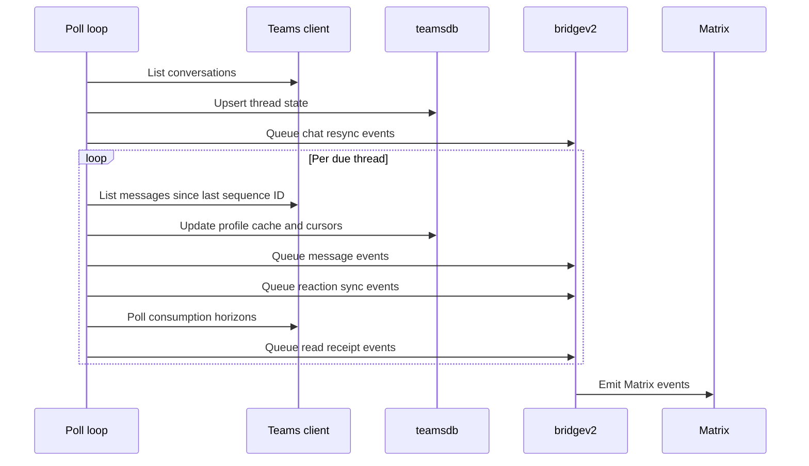
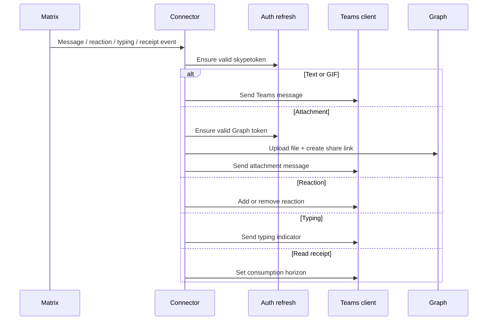

# Architecture

## Overview

`mautrix-teams` is a mautrix `bridgev2` connector that maps Matrix rooms to Teams chat threads and uses delegated user auth to act as the logged-in Teams user.

The important design choices are:

- Teams login state is captured from the Teams web app, not from a documented OAuth/device flow owned by this project.
- Teams ingress is polling-based.
- Attachments depend on delegated Microsoft Graph access.
- The bridge keeps a small Teams-specific state layer on top of bridgev2's normal portal/message/reaction tables.

## Component Map

Component responsibilities:

- `cmd/mautrix-teams`
  Starts `mxmain.BridgeMain` and registers `TeamsConnector`.

- `pkg/connector`
  Owns login flow selection, token refresh hooks, Matrix event handlers, Teams polling, and message conversion.

- `internal/teams/auth`
  Extracts refresh/access tokens from Teams web MSAL localStorage, refreshes delegated tokens, and exchanges access tokens for Teams `skypetoken` values.

- `internal/teams/client`
  Wraps reverse-engineered Teams consumer HTTP APIs for conversations, messages, reactions, typing indicators, and consumption horizons.

- `internal/teams/graph`
  Handles Graph upload/download work for files.

- `internal/bridge`
  Contains attachment orchestration and Matrix media plumbing reused by the connector.

- `pkg/teamsdb`
  Persists Teams-specific cursors and caches:
  - thread discovery/cursor state
  - observed profile display names
  - last-seen consumption horizons

## Auth Flow

Current auth model: delegated user auth only.

There is no client-credentials flow in the current codebase.

### Delegated Login

Notes:

- The connector starts a login flow called `webview_localstorage`.
- JavaScript in the webview waits for MSAL keys in localStorage and submits the full storage blob back to the bridge.
- The bridge tries to derive both:
  - a Teams chat token path (`skypetoken`)
  - a Graph token for file access

## Teams → Matrix Receive Flow

Details:

- Thread discovery runs every 30 seconds.
- Each discovered thread gets its own polling backoff state.
- Successful traffic resets backoff; idle or failing threads slow down.
- Messages are filtered by sequence ID to avoid reprocessing old history.
- Sender display names are cached in `teams_profile`.

## Matrix → Teams Send Flow

## Identity And Profile Handling

- Teams users are identified by normalized Teams user IDs and mapped directly into bridgev2 ghost IDs.
- The logged-in Teams user is stored in `UserLoginMetadata.TeamsUserID`.
- Display names are not fetched from a full authoritative profile sync.
- Instead, the bridge updates a profile cache from observed message senders and uses that cache when resolving ghost user info.

Implication:

- Profiles are good enough for active chats.
- Idle contacts may have stale or missing names until they appear in traffic again.

## Stored State

Teams-specific tables:

- `teams_thread_state`
  Stores thread ID, conversation ID, room name, DM/group flag, and last seen sequence ID.

- `teams_profile`
  Stores observed Teams display names.

- `teams_consumption_horizon_state`
  Stores last known inbound read positions for remote participants.

Per-user secret login state is stored in bridgev2's `user_login.metadata` JSON, not in these tables.

## Key Tradeoffs

### Polling Instead Of Push

Pros:

- Simple to reason about.
- No hidden long-lived Teams subscription layer to keep alive.

Cons:

- More latency than a push model.
- More API traffic.
- Backoff behavior matters for both performance and timeliness.

### Reverse-Engineered Teams APIs

Pros:

- Makes the bridge possible at all.

Cons:

- Endpoint formats, token scopes, and payload schemas can break without notice.
- Login extraction depends on Teams web client storage conventions.

### Delegated Graph Access For Files

Pros:

- Enables real file bridging instead of plain links.

Cons:

- File support is only as good as delegated Graph refresh state.
- When Graph token refresh or Drive metadata is missing, inbound attachments degrade to text/link rendering.
